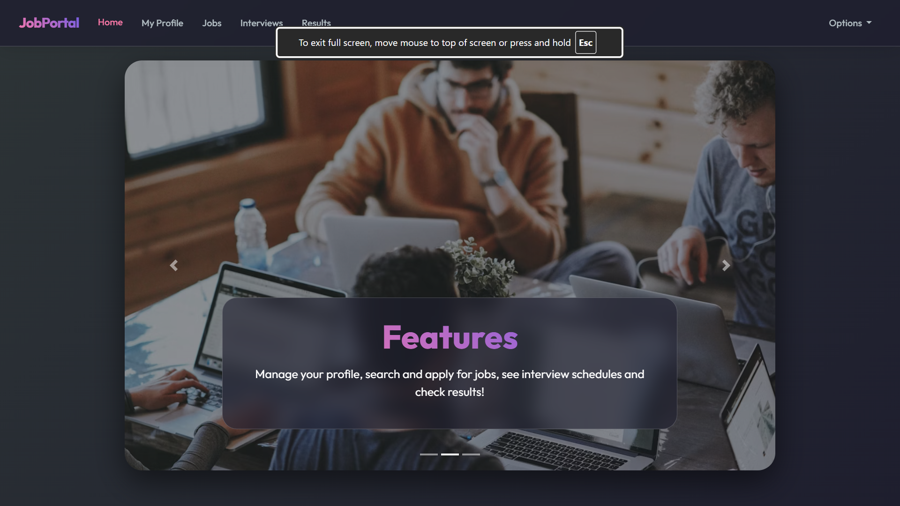

# 🌟 Modernized Online Job Portal

A feature-rich **Online Job Portal** platform built with **Flask** and **MySQL**. This project features a professional, modernized user interface with glassmorphism, smooth animations, and a cohesive design system.



## ✨ Key Features
- 🚀 **Professional UI**: Stylish modern design with vibrant gradients and smooth transitions.
- 🔐 **Secure Authentication**: Dedicated Login and Signup pages with input validation.
- 👤 **Profile Management**: Complete user profile dashboard to manage education, resumes, and personal details.
- 🔍 **Job Search**: Advanced search functionality to find jobs by keywords and location.
- 📅 **Interview Tracker**: View and manage upcoming interview schedules.
- 🏆 **Results Portal**: Stay updated on job application statuses and results.

## 🛠️ Tech Stack
- **Backend**: Python / Flask
- **Database**: MySQL
- **Frontend**: HTML5, Modern CSS (Vanilla), Bootstrap 4, Google Fonts (Outfit)
- **Icons & Effects**: FontAwesome, Animate.css, Backdrop-filter blur

## 🚀 Installation & Setup

### 1. Prerequisites
Ensure you have **Python 3.x** and **MySQL Server** installed on your system.

### 2. Install Dependencies
Run the following command in your terminal:
```bash
pip install flask flask-mysqldb
```

### 3. Database Configuration
1. Open your MySQL client (e.g., MySQL Workbench).
2. Run the provided setup script located at: `database/setup.sql`.
3. Update the database credentials in `app.py`:
```python
app.config['MYSQL_USER'] = "your_username"
app.config['MYSQL_PASSWORD'] = "your_password"
app.config['MYSQL_DB'] = "jobportal3"
```

### 4. Run the Application
```bash
python app.py
```
Open your browser and navigate to: `http://127.0.0.1:5000`

---

## 🎨 Design Highlights
- **Modern Aesthetic**: Deep Purple to Vibrant Pink gradient accents.
- **Glassmorphism**: Glass-effect navigation bars, card shadows, and 20px border-radii.
- **Responsiveness**: Fully responsive layout designed for both desktop and mobile users.
